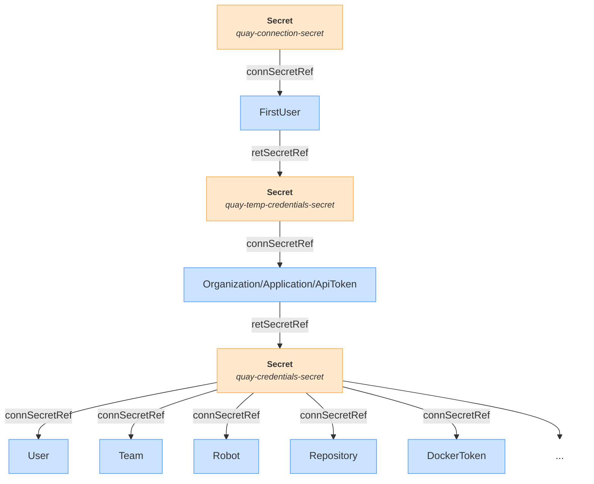

# Validating and Testing the Operator

Before submitting your work, validate and test the Operator.
GitHub Actions automatically perform the following tests when you push updates to the GitHub repository.


## Validating the Operator

Some of the following validation tests require a Kubernetes cluster to run.
All these tests are automatically performed by GitHub Actions when committing your work.
See the `.github/workflows/tests.yaml` file.

The tests use the `bundle/` directory that you build by running the `make bundle` command:

```sh
make bundle
```

Validating the bundle manifests by using the `operator-sdk bundle validate` command:

```sh
operator-sdk bundle validate ./bundle --select-optional suite=operatorframework
```

!!! note
    If the `operator-sdk` command is not available on your system, then the `make bundle` command that you used previously downloads and installs it in the `./bin` directory in the current directory.
    In that case, specify the path to the `operator-sdk` command: `./bin/operator-sdk bundle validate ...`

Validating the bundle manifests by using the `k8s-community-bundle-validator` command (see the [tools](tools.md) section to install this command).
A 0 return code indicates success:

```sh
k8s-community-bundle-validator ./bundle
echo $?
```

Validate the bundle manifests by using Scorecard.
Scorecard uses pods to run the tests, and therefore requires a Kubernetes cluster.
Ensure that you are logged in to your cluster before running Scorecard.
A 0 return code indicates success:

```sh
operator-sdk scorecard ./bundle
echo $?
```

The command returns a lot of output.
Each test reports its status in the `State` field:

```text
--------------------------------------------------------------------------------
Image:      quay.io/operator-framework/scorecard-test:v1.35.0
Entrypoint: [scorecard-test olm-bundle-validation]
Labels:
	"suite":"olm"
	"test":"olm-bundle-validation-test"
Results:
	Name: olm-bundle-validation
	State: pass

	Log:
		time="2024-05-31T16:43:27Z" level=debug msg="Found manifests directory" name=bundle-test
		time="2024-05-31T16:43:27Z" level=debug msg="Found metadata directory" name=bundle-test
		time="2024-05-31T16:43:27Z" level=debug msg="Getting mediaType info from manifests directory" name=bundle-test
		time="2024-05-31T16:43:27Z" level=debug msg="Found annotations file" name=bundle-test
		time="2024-05-31T16:43:27Z" level=debug msg="Could not find optional dependencies file" name=bundle-test


--------------------------------------------------------------------------------
Image:      quay.io/operator-framework/scorecard-test:v1.35.0
Entrypoint: [scorecard-test basic-check-spec]
Labels:
	"suite":"basic"
	"test":"basic-check-spec-test"
Results:
	Name: basic-check-spec
	State: pass


--------------------------------------------------------------------------------
Image:      quay.io/operator-framework/scorecard-test:v1.35.0
Entrypoint: [scorecard-test olm-crds-have-resources]
Labels:
	"suite":"olm"
	"test":"olm-crds-have-resources-test"
Results:
	Name: olm-crds-have-resources
	State: pass

	Log:
		Loaded ClusterServiceVersion: quay-api-operator.v1.1.0
...
```


## Testing the Operator with Molecule

The Molecule scenario tests the API Operator resources.

The scenario creates a [Kind](https://kind.sigs.k8s.io/) Kubernetes cluster, deploys a Quay Container Registry instance in this cluster, deploys the API Operator for Quay, and then uses test resources to verify that the Operator operates correctly.

The Molecule scenario configuration is stored in the `molecule/kind` directory.
Some files in this directory refer to files from the `molecule/default` directory.

### Requirements

The Molecule scenario requires that you install the following applications in your system:

* [ansible-core](https://docs.ansible.com/ansible/latest/installation_guide/)
* [Molecule](https://ansible.readthedocs.io/projects/molecule/installation/)
* The Kubernetes Python package
* [Docker](https://docs.docker.com/engine/install/)
* [Kind](https://kind.sigs.k8s.io/docs/user/quick-start)
* [kubectl](https://kubernetes.io/docs/tasks/tools/)
* [kustomize](https://kubectl.docs.kubernetes.io/installation/kustomize/)

### Running the Molecule Scenario

From the root directory of the Operator GitHub repository, run the following command:

```sh
molecule test --scenario-name kind
```

The command creates a Kind Kubernetes cluster, and then deploys a Quay Container Registry instance from the Kubernetes resources in the `molecule/default/quay` directory.
The command deploys the Operator, and runs the tests from the Ansible tasks in the `molecule/default/tasks` directory.
These tasks use the Kubernetes resources in the `config/samples` directory to test the Operator.

After the tests, the scenario deletes the Kind cluster.


## Manually Testing the Operator

Before you can test the Operator, you need to prepare your cluster:

1. [Build and publish](building.md) the container image.
2. [Deploy](deploying.md) the Operator.
3. Deploy a Quay instance for running the tests.
   You can use the [Quay Operator](https://github.com/quay/quay-operator), or use the following instructions to deploy a test Quay instance in Kubernetes or OpenShift.

### Deploying Quay in Kubernetes or OpenShift

The following instructions require a Kubernetes or OpenShift cluster, with at least 3 GiB of memory available on a node.
The Quay instance uses ephemeral storage, and you should use it only for testing the Operator.

The resources in YAML format are available in the `molecule/default/quay` directory.

1. Change to the `molecule/default/quay` directory.

        cd ./molecule/default/quay

2. Create the `quay` Kubernetes namespace to host the Quay instance.
   Do not use a different name, because the resources rely on this name.

        kubectl create namespace quay

3. Deploy the resources from the YAML files:

        kubectl apply -n quay -f postgresql.yaml
        kubectl apply -n quay -f redis.yaml
        kubectl apply -n quay -f fake-clair.yaml
        sleep 20   # Give time for the pods to be up and running
        kubectl apply -n quay -f quay.yaml
        sleep 60   # Give time for Quay to start (it might restart a few times)
        kubectl get pods -n quay # All pods should be up and running

The Quay instance is accessible only as a service, and is not accessible from outside the cluster.
The Quay instance is available at `https://quay.quay.svc.cluster.local` from inside the cluster.

This Quay installation enables the first user creation feature (`FEATURE_USER_INITIALIZE` in `config.yaml`), which allows you to test the `FirstUser` Kubernetes resource to bootstrap Quay.

### Applying the Test Resources

The `config/samples` directory stores some sample resource files in YAML format that you can use to test the Operator.

The resources refer to Secrets to retrieve the Quay connection parameters.
However, you only have to create the Secret for the `FirstUser` resource, which in turn creates a Secret to store the temporary Quay credentials.
Then, the `ApiToken` resource uses that new secret to generate a permanent OAuth access token that it stores in a third Secret resource, which in turn is used by all the other resources.



Before applying the resources, create a namespace and the Secret for the `FirstUser` resource.

```sh
kubectl create namespace test-operator
kubectl create secret generic quay-connection-secret -n test-operator \
  --from-literal host=https://quay.quay.svc.cluster.local \
  --from-literal validateCerts=false
```

Use the `kubectl apply` command to deploy all the resources:

```sh
kubectl apply -n test-operator -k config/samples
```

Most resources initially report an error state, because the Secret that provides the Quay connection parameters does not exist yet (the `FirstUser` and `ApiToken` resources must complete first).
It takes 30 minutes to reconcile.

You can review the status of the resources by using the following loop:

```sh
for i in apitoken.quay.herve4m.github.io/apitoken-sample \
  application.quay.herve4m.github.io/application-sample \
  defaultperm.quay.herve4m.github.io/defaultperm-sample \
  dockertoken.quay.herve4m.github.io/dockertoken-sample \
  firstuser.quay.herve4m.github.io/firstuser-sample \
  manifestlabel.quay.herve4m.github.io/manifestlabel-sample \
  message.quay.herve4m.github.io/message-sample \
  notification.quay.herve4m.github.io/notification-sample \
  organization.quay.herve4m.github.io/organization-sample \
  proxycache.quay.herve4m.github.io/proxycache-sample \
  quota.quay.herve4m.github.io/quota-sample \
  repository.quay.herve4m.github.io/repository-sample-1 \
  repository.quay.herve4m.github.io/repository-sample-2 \
  repositorymirror.quay.herve4m.github.io/repositorymirror-sample \
  robot.quay.herve4m.github.io/robot-sample \
  tag.quay.herve4m.github.io/tag-sample \
  team.quay.herve4m.github.io/team-sample \
  teamldap.quay.herve4m.github.io/teamldap-sample \
  teamoidc.quay.herve4m.github.io/teamoidc-sample \
  user.quay.herve4m.github.io/user-sample
do
  kubectl get -n test-operator --no-headers $i
done
```

!!! note
    The `manifestlabel-sample`, `teamldap-sample`, `teamoidc-sample`, and `tag-sample` resources stay in the error state.
    This state is expected because these resources depend on Quay features or container images that are not available in this test environment.

### Deleting the Test Resources

Delete the resources by using the `kubectl delete` command.
Delete the Organization, Application, ApiToken, and FirstUser resources at the end, because they control the secrets  that the other resources uses to access Quay.

```sh
kubectl delete -n test-operator \
  defaultperm.quay.herve4m.github.io/defaultperm-sample \
  dockertoken.quay.herve4m.github.io/dockertoken-sample \
  manifestlabel.quay.herve4m.github.io/manifestlabel-sample \
  message.quay.herve4m.github.io/message-sample \
  notification.quay.herve4m.github.io/notification-sample \
  proxycache.quay.herve4m.github.io/proxycache-sample \
  quota.quay.herve4m.github.io/quota-sample \
  repository.quay.herve4m.github.io/repository-sample-1 \
  repository.quay.herve4m.github.io/repository-sample-2 \
  repositorymirror.quay.herve4m.github.io/repositorymirror-sample \
  robot.quay.herve4m.github.io/robot-sample \
  tag.quay.herve4m.github.io/tag-sample \
  team.quay.herve4m.github.io/team-sample \
  teamldap.quay.herve4m.github.io/teamldap-sample \
  teamoidc.quay.herve4m.github.io/teamoidc-sample \
  user.quay.herve4m.github.io/user-sample
kubectl delete -n test-operator \
  apitoken.quay.herve4m.github.io/apitoken-sample \
  application.quay.herve4m.github.io/application-sample \
  organization.quay.herve4m.github.io/organization-sample
kubectl delete -n test-operator firstuser.quay.herve4m.github.io/firstuser-sample
kubectl delete namespace test-operator
```

You can delete the Quay installation by deleting the `quay` namespace:

```sh
kubectl delete namespace quay
```
